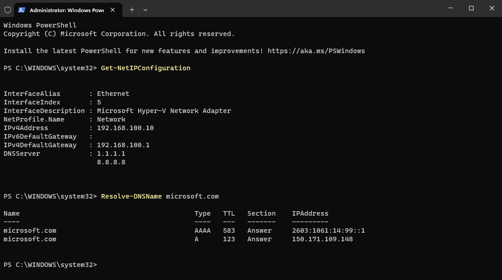
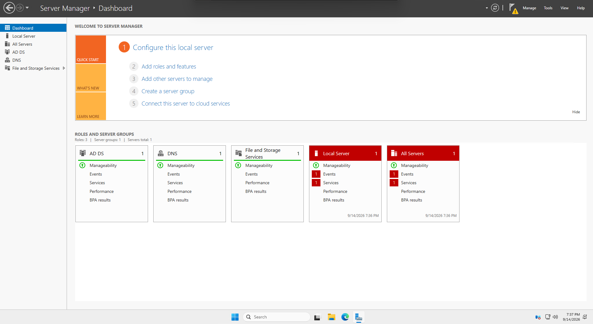
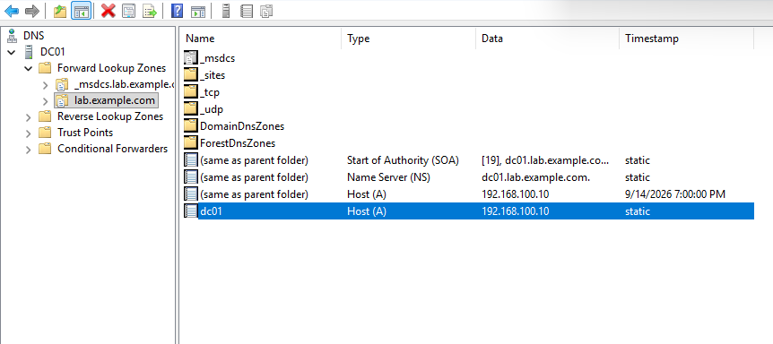
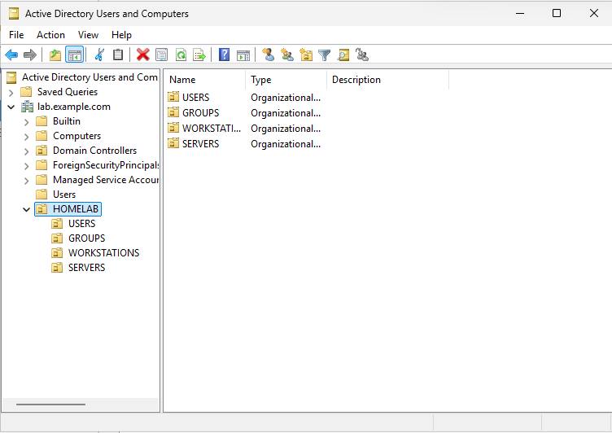

# Active-Directory-Home-Lab
Windows Hyper-V Active Directory home lab demonstrating AD DS, DNS, OU design, domain joins, Group Policy, and PowerShell administration.
# Windows Active Directory Home Lab

## Overview

This project documents the design and implementation of a Windows Active Directory home lab using Microsoft Hyper-V.

The lab was built to gain hands-on experience with enterprise Windows administration, including:

- Windows Server 2025
- Active Directory Domain Services (AD DS)
- DNS
- Organizational Units (OUs)
- User and security group administration
- Windows 11 domain joining
- Group Policy
- PowerShell
- Hyper-V networking

The environment consists of a Windows Server 2025 domain controller and a Windows 11 client connected through a private Hyper-V NAT network.

## Lab Environment

| System | Operating System | IP Address | Purpose |
|---|---|---|---|
| DC01 | Windows Server 2025 | 192.168.100.10 | Domain Controller, AD DS, DNS |
| CLIENT01 | Windows 11 Enterprise | 192.168.100.11 | Domain-joined workstation |

### Network Configuration

- Network: `192.168.100.0/24`
- Default Gateway: `192.168.100.1`
- Domain: `lab.example.com`
- NetBIOS Domain: `LAB`
- DNS Server: `192.168.100.10`

## Project Goals

The goals of this lab are to:

- Deploy and configure a Windows Server domain controller
- Configure Active Directory-integrated DNS
- Create and organize users, groups, and computer objects
- Join Windows clients to an Active Directory domain
- Apply and verify Group Policy
- Practice Windows administration with PowerShell
- Document troubleshooting and validation steps

## 1. DC01 Network Configuration

Configured DC01 with a static IPv4 address in order to assure domain controller and DNS server would always be reachable at a predictable address.

- IP Address: `192.168.100.10`
- Subnet: `192.168.100.0/24`
- Default Gateway: `192.168.100.1`
- DNS: configured for external resolution prior to promoting DC01 to a DNS server

Verified network connectivity and DNS resolution using Powershell.

## 2. Active Directory and DNS Setup

Installed the **Active Directory Domain Services (AD DS)** and **DNS Server** roles on DC01.

AD DS provides the directory services used to manage domain users, computers, groups, authentication, and Group Policy, while DNS server is required for clients to locate domain controllers and other domain services by Active Directory.

After installing the roles, DC01 was promoted to a domain controller for the `lab.example.com` domain.

## 3. Active Directory DNS Configuration

An Active Directory-integrated DNS zone was created for `lab.example.com`.

The DNS zone contains the necessary records for AD service discovery, including `_tcp` `_udp`, `_sites`, `DomainDnsZones` and `ForestDnsZones`. 

I verified that `dc01.lab.example.com` resolves to the static IP address of `192.168.100.10`.

## 4. Organizational Unit Structure

Created a custom `HOMELAB` OU to separate lab objects from the default AD containers.

Created separate OUs in `HOMELAB` for:

- `USERS`
- `GROUPS`
- `WORKSTATIONS`
- `SERVERS`

This structure allows for easier organization of directory objects and application of Group Policy to specific categories of users and computers.

## 5. User and Group Administration

Created the domain user `Alex Rivera` and added the account to the `IT-Helpdesk` security group.

Verified group membership using PowerShell with:

`Get-ADGroupMember -Identity "IT-Helpdesk" | Select-Object Name,SamAccountName,ObjectClass`

