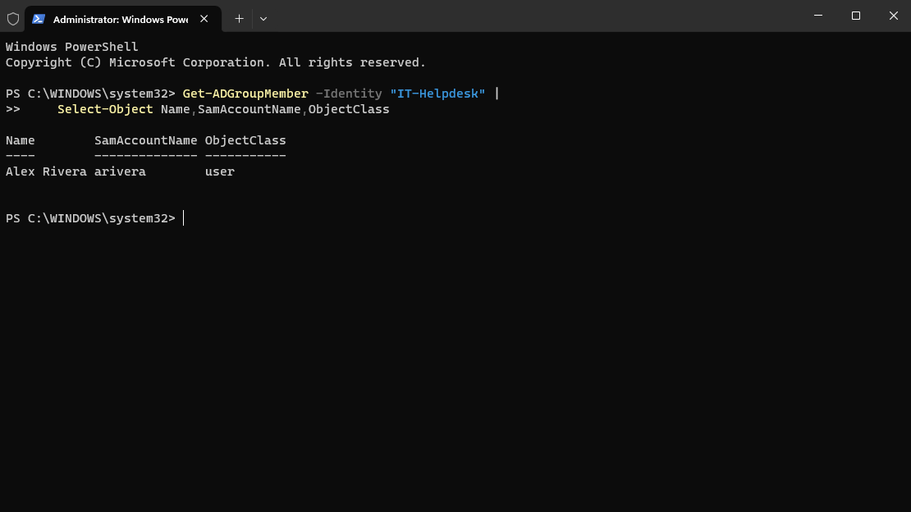
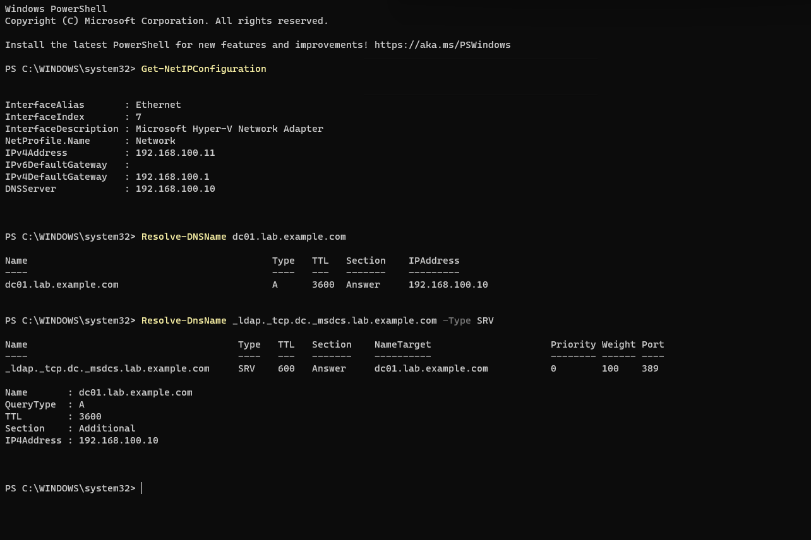
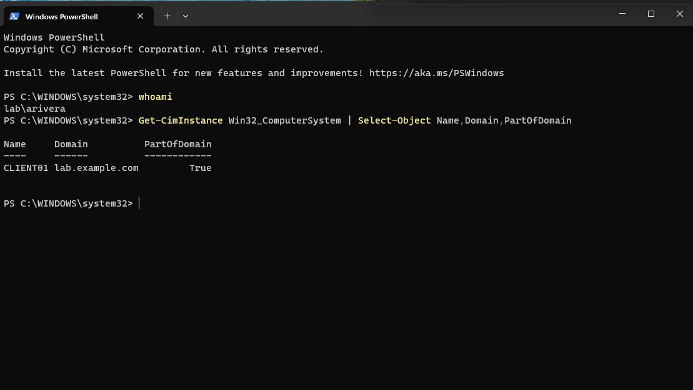
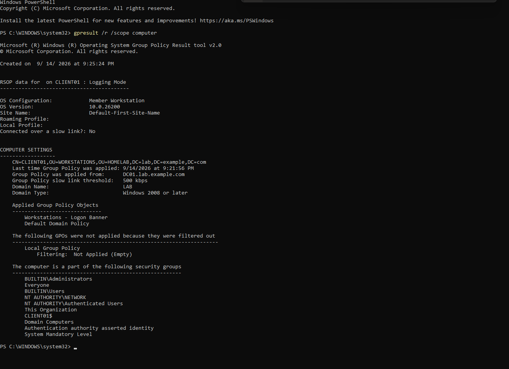
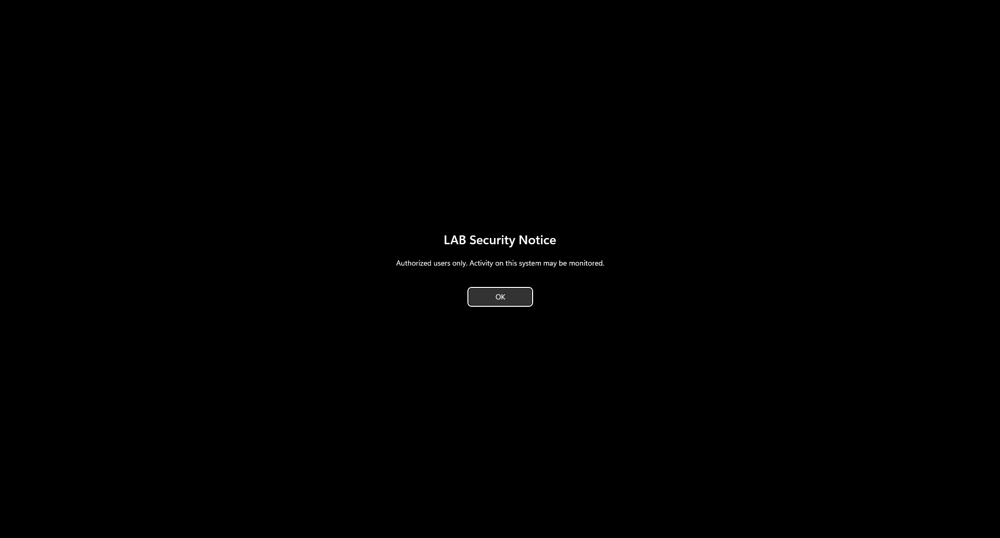
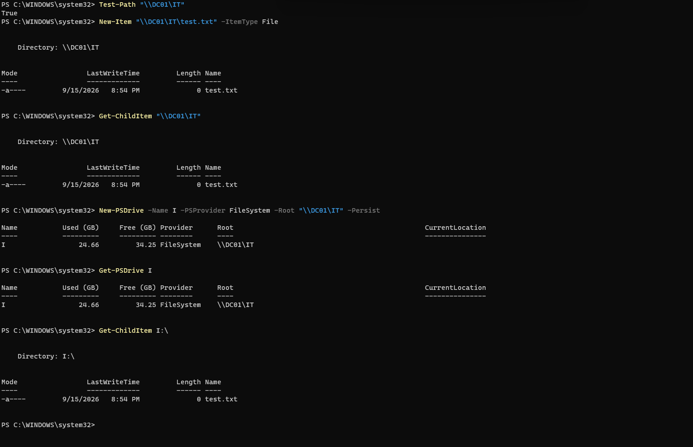

# Windows Active Directory Home Lab

Windows Hyper-V Active Directory home lab demonstrating AD DS, DNS, OU design, domain joins, Group Policy, PowerShell administration, and basic help desk troubleshooting.

## Overview

This project documents the design and implementation of a Windows Active Directory home lab using Microsoft Hyper-V.

The lab was built to gain hands-on experience with enterprise Windows administration, including:

- Windows Server 2025
- Active Directory Domain Services (AD DS)
- DNS
- Organizational Units (OUs)
- User and security group administration
- Windows 11 domain joining
- Group Policy
- PowerShell
- Hyper-V networking

The environment consists of a Windows Server 2025 domain controller and a Windows 11 client connected through a private Hyper-V NAT network.

## Lab Environment

| System | Operating System | IP Address | Purpose |
|---|---|---|---|
| DC01 | Windows Server 2025 | 192.168.100.10 | Domain Controller, AD DS, DNS |
| CLIENT01 | Windows 11 Enterprise | 192.168.100.11 | Domain-joined workstation |

### Network Configuration

- Network: `192.168.100.0/24`
- Default Gateway: `192.168.100.1`
- Domain: `lab.example.com`
- NetBIOS Domain: `LAB`
- DNS Server: `192.168.100.10`

## Project Goals

The goals of this lab are to:

- Deploy and configure a Windows Server domain controller
- Configure Active Directory-integrated DNS
- Create and organize users, groups, and computer objects
- Join Windows clients to an Active Directory domain
- Apply and verify Group Policy
- Practice Windows administration with PowerShell
- Document troubleshooting and validation steps

## 1. DC01 Network Configuration

Configured `DC01` with a static IPv4 address to ensure the domain controller and DNS server would always be reachable at a predictable address.

- IP Address: `192.168.100.10`
- Subnet: `192.168.100.0/24`
- Default Gateway: `192.168.100.1`
- DNS: configured for external resolution prior to promoting DC01 to a DNS server

Verified network connectivity and DNS resolution using PowerShell.

## 2. Active Directory and DNS Setup

Installed the **Active Directory Domain Services (AD DS)** and **DNS Server** roles on `DC01`.

AD DS provides the directory services used to manage domain users, computers, groups, authentication, and Group Policy. DNS allows clients to locate domain controllers and other Active Directory services.

After installing the roles, `DC01` was promoted to a domain controller for the `lab.example.com` domain.

## 3. Active Directory DNS Configuration

An Active Directory-integrated DNS zone was created for `lab.example.com`.

The DNS zone contains the records required for AD service discovery, including `_tcp`, `_udp`, `_sites`, `DomainDnsZones`, and `ForestDnsZones`.

Verified that `dc01.lab.example.com` resolves to the static IP address `192.168.100.10`.

## 4. Organizational Unit Structure

Created a custom `HOMELAB` OU to separate lab objects from the default Active Directory containers.

Created separate OUs within `HOMELAB` for:

- `USERS`
- `GROUPS`
- `WORKSTATIONS`
- `SERVERS`

This structure allows for easier organization of directory objects and targeted application of Group Policy to specific categories of users and computers.

## 5. User and Group Administration

Created the domain user `Alex Rivera` and added the account to the `IT-Helpdesk` security group.

Verified group membership using PowerShell with:

`Get-ADGroupMember -Identity "IT-Helpdesk" | Select-Object Name,SamAccountName,ObjectClass`

## 6. CLIENT01 Network and DNS Configuration

Configured `CLIENT01` with a static IPv4 address.

- IP Address: `192.168.100.11`
- Subnet: `192.168.100.0/24`
- Default Gateway: `192.168.100.1`
- DNS Server: `192.168.100.10`

Configured `CLIENT01` to use `DC01` as its DNS server, allowing the workstation to resolve the `lab.example.com` domain and locate Active Directory services.

Verified that `dc01.lab.example.com` resolved to `192.168.100.10` and confirmed AD service discovery by querying the LDAP SRV record, which returned `DC01` on port `389`.

## 7. CLIENT01 Domain Join

Joined `CLIENT01` to the `lab.example.com` Active Directory domain using the domain administrator account to authorize the join.

After restarting `CLIENT01`, I signed in using the domain user account `LAB\arivera`.

Verified the authenticated user with:

`whoami`

which returned:

`lab\arivera`

Confirmed that `CLIENT01` was successfully joined to the domain with:

`Get-CimInstance Win32_ComputerSystem | Select-Object Name,Domain,PartOfDomain`

The output showed `lab.example.com` as the domain and `PartOfDomain` as `True`.

## 8. Group Policy Verification

Created and linked the `Workstations - Logon Banner` Group Policy Object to the `WORKSTATIONS` OU.

After refreshing Group Policy on `CLIENT01`, I verified the applied computer policies with:

`gpresult /r /scope computer`

The output confirmed that `CLIENT01` received the `Workstations - Logon Banner` GPO from `DC01.lab.example.com`.

It also confirmed that the `CLIENT01` computer object was located in the expected OU:

`OU=WORKSTATIONS,OU=HOMELAB,DC=lab,DC=example,DC=com`

## 9. Group Policy Result

After the `Workstations - Logon Banner` GPO was applied to `CLIENT01`, the configured security notice appeared before sign-in.

This confirmed that the workstation successfully received and enforced the Group Policy setting from the domain.

## 10. Network Share and Drive Mapping

Created an SMB share on `DC01` and granted access through the `IT-Helpdesk` security group.

From `CLIENT01`, verified access to `\\DC01\IT`, created a test file, and mapped the share to drive `I:` using PowerShell.

`New-PSDrive -Name I -PSProvider FileSystem -Root "\\DC01\IT" -Persist`

The mapped drive was then verified with `Get-PSDrive` and `Get-ChildItem`.

## 11. Simulated Help Desk Ticket - Password Reset

Created and resolved a simulated help desk ticket for a user who could not sign in to their domain account.

### Troubleshooting Summary

- Verified the `arivera` account existed in Active Directory
- Confirmed the account was enabled and not locked out
- Reset the user's domain password
- Required a password change at the next logon
- Verified the updated `PasswordLastSet` value in Active Directory
- Confirmed successful authentication to `CLIENT01`

The incident was documented using GitHub Issues to simulate a basic help desk ticket workflow.

[View the completed password reset ticket](https://github.com/artstep00/active-directory-home-lab/issues/1)

## 12. Simulated Help Desk Ticket - Network Share Access

Created and resolved a simulated help desk ticket for a user who could no longer access the `IT` network share.

### Troubleshooting Summary

- Confirmed `CLIENT01` could reach `DC01` over SMB port `445`
- Verified `arivera` was still a member of the `IT-Helpdesk` security group
- Identified incorrect SMB share permissions on `\\DC01\IT`
- Restored `Change` access for the `LAB\IT-Helpdesk` group
- Verified the user could access and create files in the share
- Remapped the share to drive `I:` and confirmed successful access

The incident was documented using GitHub Issues to simulate a help desk troubleshooting and resolution workflow.

[View the completed network share access ticket](https://github.com/artstep00/active-directory-home-lab/issues/2)

